<table class="tbl-heading"><tr><td class="td-logo">

<!--September 21, 2018-->
</td>
<td class="td-banner">
# Lab 3: Loading Data into Your New Autonomous Data Warehouse
</td></tr><table>


## Introduction

In this lab, you will be uploading files to the Oracle Cloud Infrastructure (OCI) Object Storage, creating sample tables, loading data into them from files on the OCI Object Storage, and troubleshooting data loads with errors.

You can load data into your new Autonomous Data Warehouse (ADW) database using Oracle Database tools, and Oracle and 3rd party data integration tools. You can load data:

+ from files local to your client computer, or
+ from files stored in a cloud-based object store

For the fastest data loading experience Oracle recommends uploading the source files to a cloud-based object store, such as Oracle Cloud Infrastructure Object Storage, before loading the data into your Autonomous Data Warehouse Cloud.

To load data from files in the cloud into your Autonomous Data Warehouse database, use the new PL/SQL `DBMS_CLOUD` package. The `DBMS_CLOUD` package supports loading data files from the following Cloud sources: Oracle Cloud Infrastructure Object Storage, Oracle Cloud Infrastructure Object Storage Classic, Amazon AWS S3, and Microsoft Azure Object Store.

This lab shows how to load data from Oracle Cloud Infrastructure Object Storage using two of the procedures in the `DBMS_CLOUD` package:

+ **create_credential**: Stores the object store credentials in your Autonomous Data Warehouse schema.
    + You will use this procedure to create object store credentials in your ADW admin schema.
+ **copy_data**: Loads the specified source file to a table. The table must already exist in ADW.
    + You will use this procedure to load tables in your admin schema with data from data files staged in the Oracle Cloud Infrastructure Object Storage cloud service.

For more information about loading data, see the documentation <a href="https://www.oracle.com/pls/topic/lookup?ctx=en/cloud/paas/autonomous-data-warehouse-cloud&id=CSWHU-GUID-07900054-CB65-490A-AF3C-39EF45505802" target="_blank">Loading Data from Files in the Cloud</a>.

To **log issues**, click <a href="https://github.com/millerhoo/journey4-adwc/issues/new" target="_blank"> here </a> to go to the GitHub Oracle repository issue submission form.

## Objectives

-   Learn how to use the SQL Developer Data Import Wizard

-   Learn how to upload files to the OCI Object Storage

-   Learn how to define object store credentials for your ADW

-   Learn how to create tables in your database

-   Learn how to load data from the Object Store

-   Learn how to troubleshoot data loads

## Required Artifacts

-   The following lab requires an Oracle Cloud account. You may use your own cloud account, a cloud account that you obtained through a trial, or a training account whose details were given to you by an Oracle instructor.

-   Oracle SQL Developer (see Lab Guide 1 for more specifics on the version of SQL Developer and how to install and configure it).

# Download Sample Data


#### **STEP 1: Download the Sample Data Files to Your Local Computer**

-   For this lab, you will need a handful of data files.  Click <a href="./files/files.zip" target="_blank">here</a> to download a zipfile of the sample source files for you to upload to the object store. Unzip it to a directory on your local computer.

# Load data from the local file system


#### **STEP 2: Loading Data Using the Data Import Wizard in SQL Developer**

-   Click ‘**Tables**’ in your user schema object tree. Click the right mouse button to open the context-sensitive menu in SQL Developer; select ‘**Import Data**’:

    

-   The Data Import Wizard is started. Enter the following information:

    -   Select **Local File** as source for the data load

    -   Click the browse button and navigate to the channels.csv file (you extracted this file from the zip file you downloaded at the start of this lab).

    - You might see a read error since channels.csv has lines terminated by ";", as is sometimes the case with certain data. Manually enter a semi-colon in the **line terminator** box to properly parse the data.

After selecting the file, you can preview the data and select the appropriate file formats. You will see that the data preview is interactive and changes according to your selection.

When you are satisfied with the file content view, click **NEXT**.

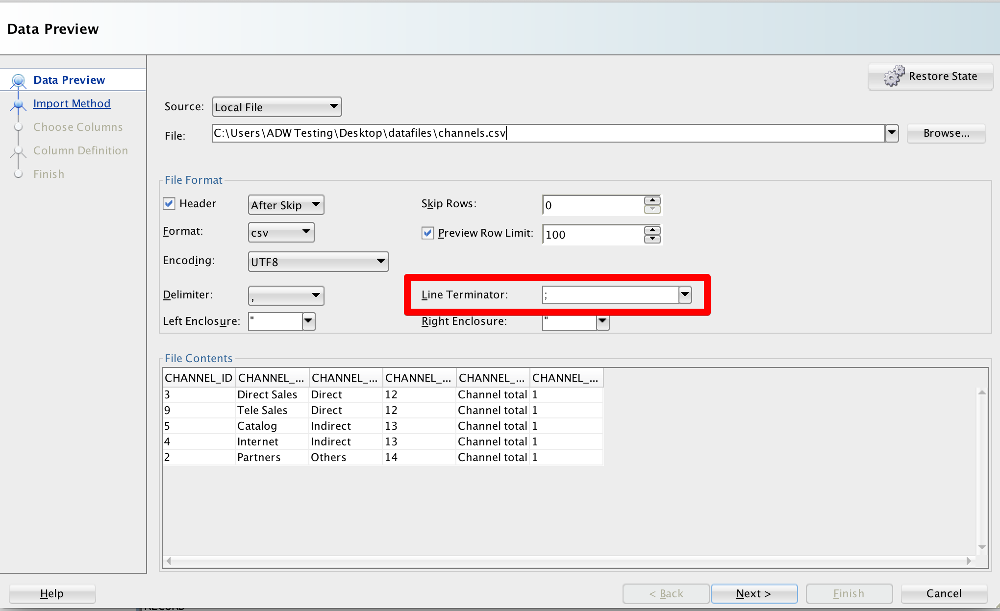
<!--When newline is fixed 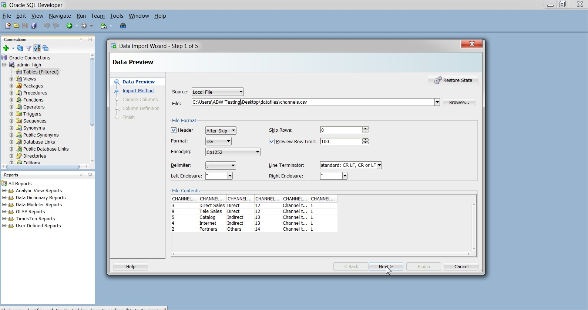-->

-   On Step 2 of the Import Wizard, you control the import method and parameters. Leave the Import Method as Insert. Enter *CHANNELS_LOCAL* as your target table name, this table will be created by the import wizard. Click **NEXT**.

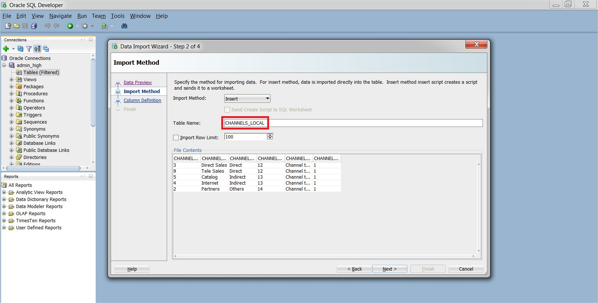

-   The Choose Columns screen lets you select the columns you want to import.  Leave the defaults and click **NEXT**.

-   The column definition screen allows you to set the column names and data types for your new table. You can change these if you need to. For this exercise leave them as default and click **NEXT**.


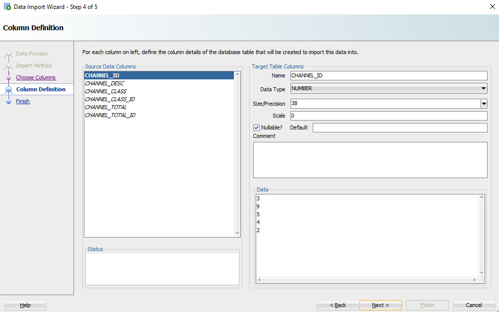

-   The final screen reflects all your choices made in the Wizard. Click **FINISH** to load the data into your newly created table *CHANNELS_LOCAL*. If you don't see it in your object tree under Tables, right click on Tables and hit refresh.

 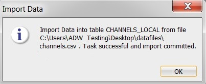


# Create the target tables

#### **STEP 3: Create Target Tables for Data Loading**

-   Connected as your user in SQL Developer, copy and paste <a href="./scripts/300/create_tables.txt" target="_blank">this code snippet</a> to SQL Developer worksheet. Take a moment to examine the script. Then click the **Run Script** button to run it.

-   It is expected that you may get ORA-00942 *table or view does not exist* errors during the DROP TABLE commands for the first execution of the script, but you should not see any other errors.

    

Note that you do not need to specify anything other than the list of columns when creating tables in the SQL scripts. You can use primary keys and foreign keys if you want, but they are not required.


# Setup the OCI Object Store

#### **STEP 4: Navigate to Object Storage**

-  From the Autonomous Data Warehouse console, pull out the left side menu from the top-left corner and select **Object Storage > Object Storage**. To revisit signing-in and navigating to ADW, please see [Lab 1](LabGuide1.md).

  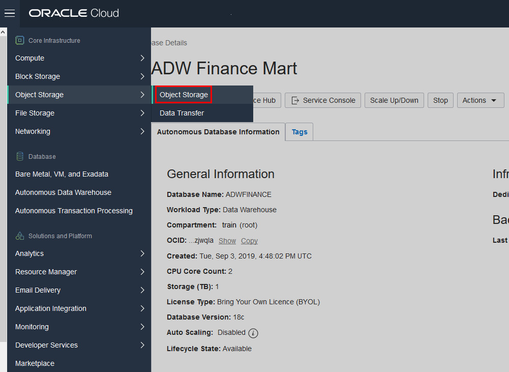

  To learn more about the OCI Object Storage, refer to its <a href="https://docs.us-phoenix-1.oraclecloud.com/Content/GSG/Tasks/addingbuckets.htm" target="_blank">documentation</a> .

-   You should now be on the **Object Storage** page. Choose the **root** compartment in the **Compartment** drop-down if it is not already chosen.
    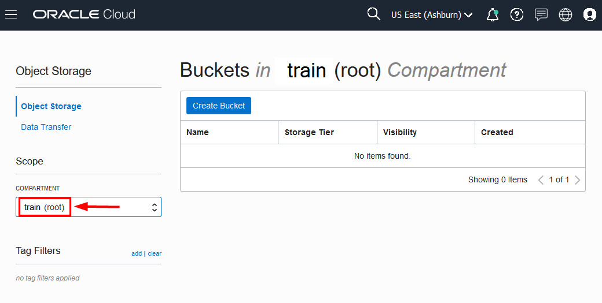

#### **STEP 5: Create a Bucket for the Object Storage**
In OCI Object Storage, a bucket is the terminology for a container of multiple files.

-   Click the **Create Bucket** button:

    

-   Name your bucket **ADWCLab** and click the **Create Bucket** button.

    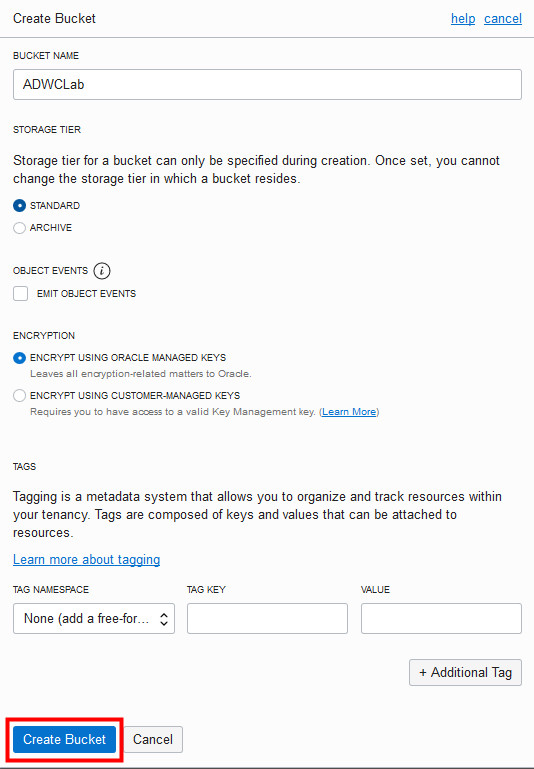

#### **STEP 6: Upload Files to Your OCI Object Store Bucket**

-   Click your **bucket name** to open it:

    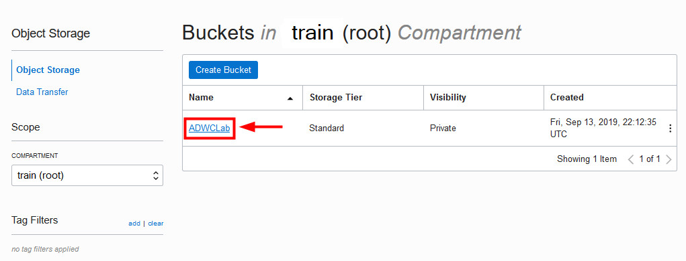

-   Click the **Upload Objects** button:

    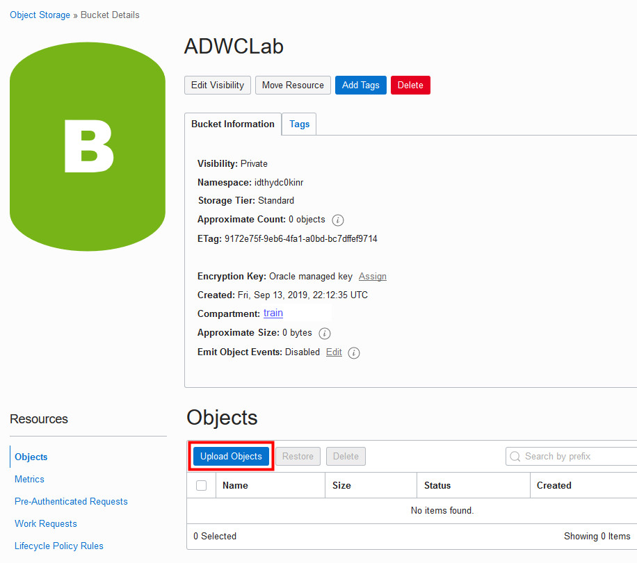

-   Drag and drop, or click  **select files**,  to select all the files downloaded in Step 1. Click **Upload Objects** and wait for the upload to complete:

    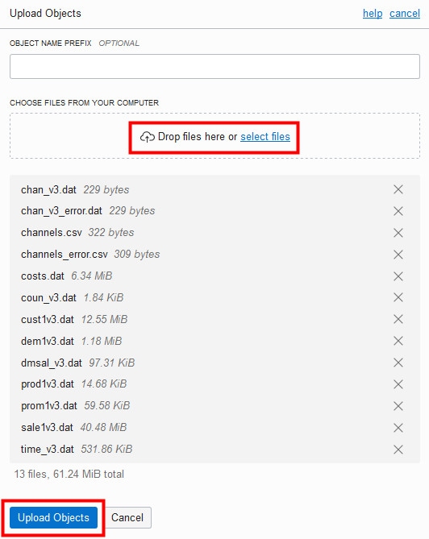

-   Repeat this for all files you downloaded in Step 1 for this lab. When the upload is complete, click **Close.**

-   The end result should look like this with all files listed under Objects:

    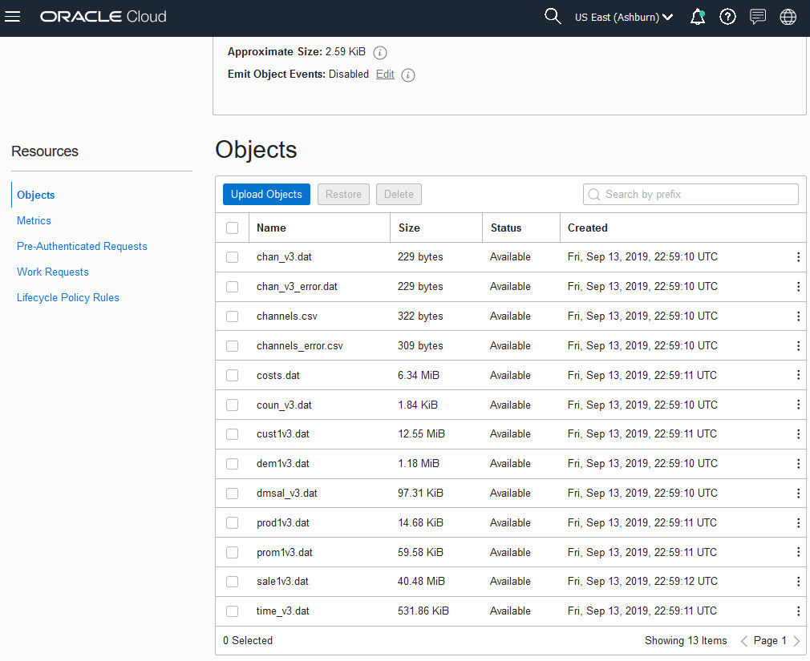

#### **STEP 7: Copy the URL for the Files in Your OCI Object Storage**
-   Copy following base URL that points to the location of your files staged in the OCI Object Storage. The simplest way to get this URL is from the "Object Details" in the right hand side ellipsis menu in the Object Store.


 


 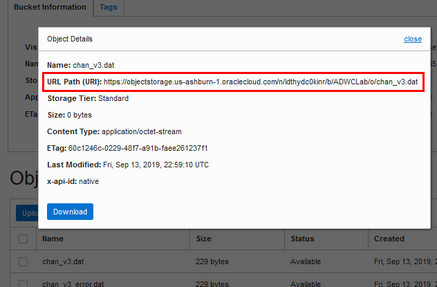

 - Take a look at the URL you copied. In this example above, the **region name** is us-ashburn-1, the **Namespace** is idthydc0kinr, and the **bucket name** is ADWCLab.

*Note:* The URL can also be constructed as below:

https://objectstorage.<**region_name**>.oraclecloud.com/n/<**namespace_name**>/b/<**bucket_name**>/o


-   **Save** the base URL you copied in a note. We will use the base URL in upcoming steps.

#### **STEP 8: Creating an Object Store Auth Token**

To load data from the Oracle Cloud Infrastructure(OCI) Object Storage you will need an OCI user with the appropriate privileges to read data (or upload) data to the Object Store. The communication between the database and the object store relies on the Swift protocol and the OCI user Auth Token.

-   Go back to the **Autonomous Data Warehouse Console** in your browser. From the pull-out menu on the top left, under **Identity**, click **Users**.

    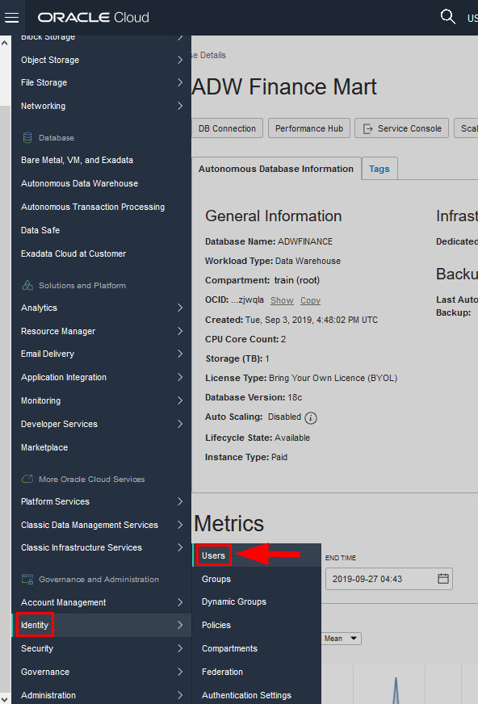

-   Click the **user's name** to view the details.  Also, remember the username as you will need that in the next step. This username could also be an email address.

    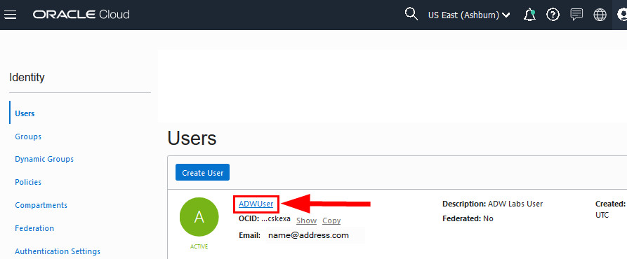

-   On the left side of the page, click **Auth Tokens**.

    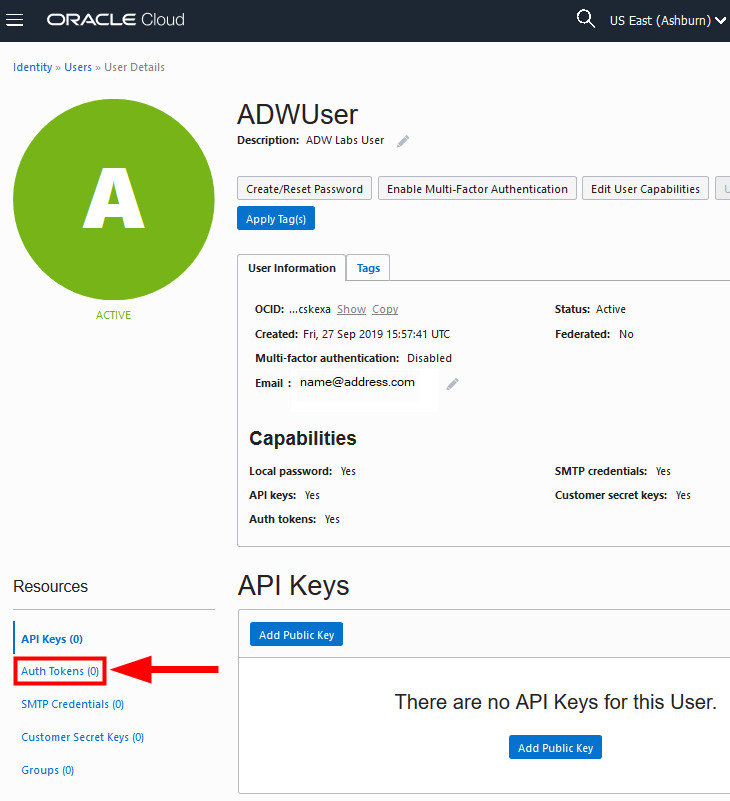

-   Click **Generate Token**.

    

-   Enter a meaningful **description** for the token and click **Generate Token**.

    

-   The new Auth Token is displayed. Click **Copy** to copy the Auth Token to the clipboard.  You probably want to save this in a temporary notepad document for the next few minutes (you'll use it in the next step).
    *Note: You can't retrieve the Auth Token again after closing the dialog box.*

    

-  Click **Close** to close the Generate Token dialog.

#### **STEP 9: Create a Database Credential for Your User**

In order to access data in the Object Store you have to enable your database user to authenticate itself with the Object Store using your OCI object store account and Auth token. You do this by creating a private CREDENTIAL object for your user that stores this information encrypted in your Autonomous Data Warehouse. This information is only usable for your user schema.

-   Connected as your user in SQL Developer, copy and paste <a href="./scripts/300/create_credential.txt" target="_blank">this code snippet</a> to SQL Developer worksheet.

    Specify the credentials for your Oracle Cloud Infrastructure Object Storage service: The username will be your **OCI username** (usually your email address, not your database username) and the password is the OCI Object Store **Auth Token** you generated in the previous step.  In this example, the credential object named **OBJ\_STORE\_CRED** is created. You reference this credential name in the following steps.

    

<!-- -->

-   Run the script.

    

-   Now you are ready to load data from the Object Store.


# Load data from the Object Store using the Data Import Wizard


#### **STEP 10: Loading Data Using the Data Import Wizard in SQL Developer**


-   Click ‘**Tables**’ in your user schema object tree. Clicking the right mouse button opens the context-sensitive menu in SQL Developer; select ‘**Import Data**’:

    

-   The Data Import Wizard is started. Enter the following information:

    -   Select **Oracle Cloud Storage** as source for the data load.

    -   Enter the URL of **channels.csv** as the file to load. You copied or constructed the URL in STEP 8 Copy the URLs of the Files on Your OCI Object Storage. For example, the URL might look something like:
        https://YOUR OBJECT STORE.oraclecloud.com/n/idthydc0kinr/b/ADWCLab/o/channels.csv

    -   Select the Credential you previously created for authentication with the Object Store, **OBJ\_STORE\_CRED**

  -   For this file, set the format as **csv** and encoding as **UTF8**.

    -   You might see a read error since channels.csv has lines terminated by ";", as is sometimes the case with certain data. Manually enter a semi-colon in the **line terminator** box to properly parse the data.

    -   Click the **Preview** button

<!--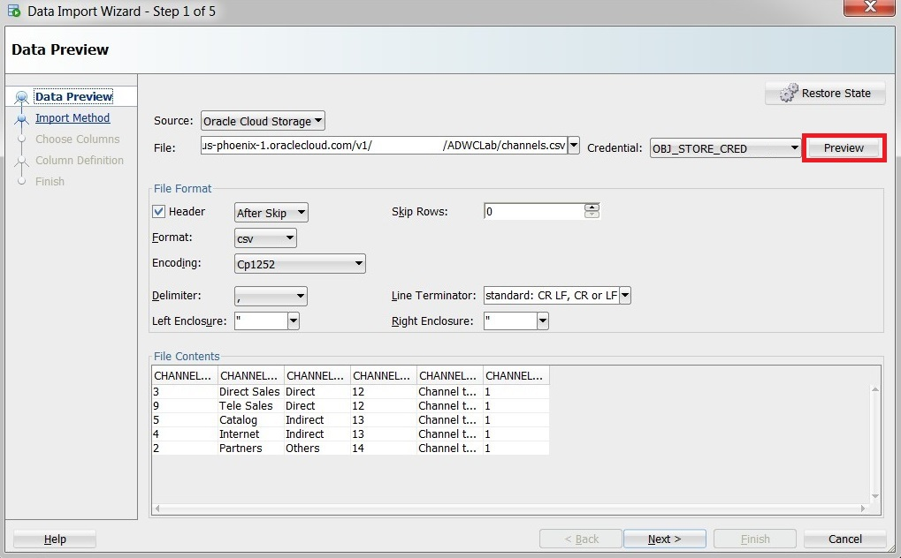-->
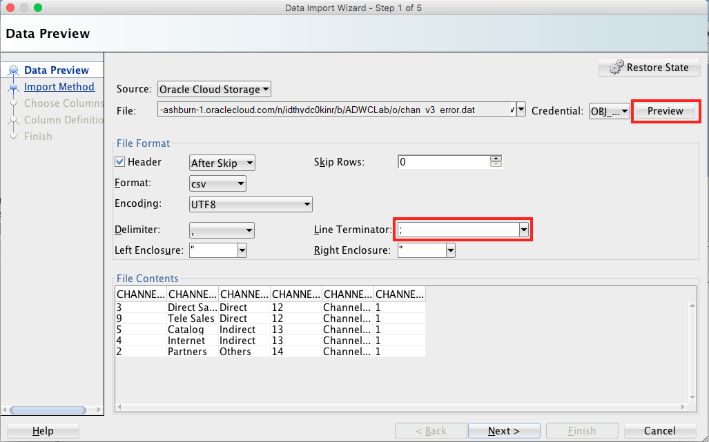

When you are satisfied with the data preview, click **NEXT**.

*Note:* If you see an object not found error here, your user may not be set up properly to have data access to the object store. Please contact your Cloud Administrator.

  - On the Import Method page, you can click on Load Options to see some of the available options.  For this exercise, leave the options at their defaults. Enter *CHANNELS_CLOUD* as the table name and click **NEXT** to advance to the next page of the wizard.

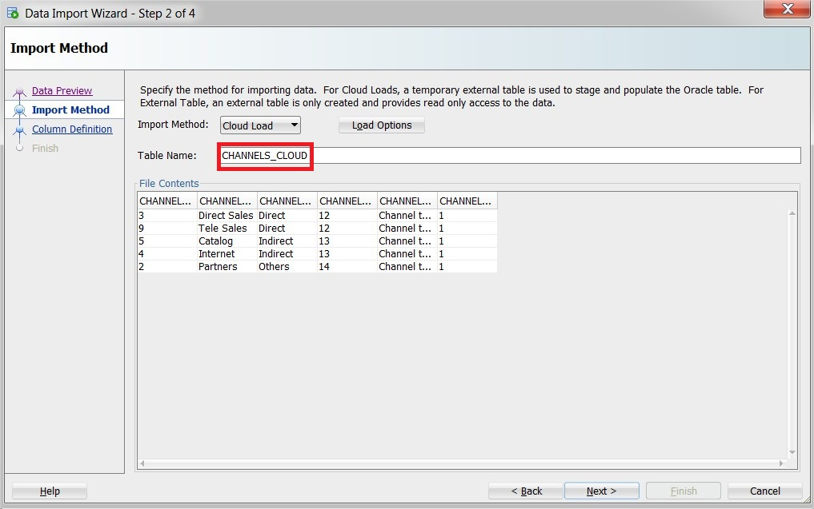

  -   On the Column Definition page, you can control how the fields of the file map to columns in the table.  You can also adjust certain properties such as the Data Type of each column. This data needs no adjustment, we can simply proceed by clicking **Next**.

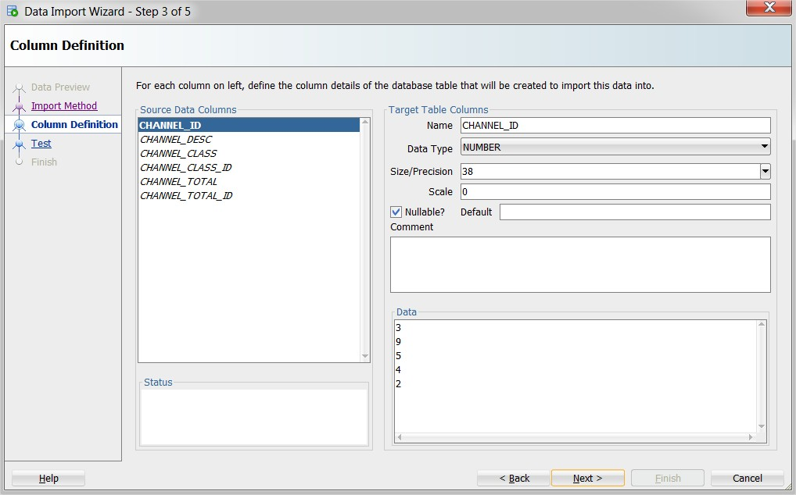

-   The last screen before the final data load enables you to test a larger row count than the sample data of the beginning of the wizard, to see whether the previously made decisions are satisfying for your data load. Note that we are not actually loading any data into your database during these Tests. Click **TEST** and look at the Test Results log, the data you would load, any mistakes and what the external table definition looks like based on your inputs.

When done with your investigation, click **NEXT**.

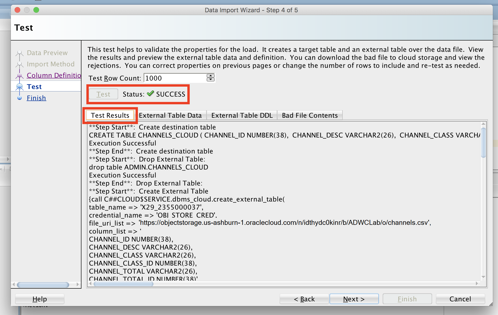


-   The final screen reflects all your choices made in the Wizard. Click **FINISH** when you are ready to load the data into the table *CHANNELS_CLOUD*.

# Load data from the Object Store using DBMS_CLOUD


#### **STEP 11: Loading Data Using the PL/SQL Package, DBMS_CLOUD**

As an alternative to the wizard-guided data load, you can use the PL/SQL package **DBMS_CLOUD** directly. This is the preferred choice for any load automation.

-   Connected as your user in SQL Developer, copy and paste <a href="./scripts/300/load_data.txt" target="_blank">this code snippet</a> to SQL Developer worksheet. This scripts uses the **copy\_data** procedure of the **DBMS\_CLOUD** package to copy the data in the source files to the target tables you created before.

    -   At the top of the script, specify the Object Store base URL in the definition of the **base\_URL** variable. You have copied and saved this URL in the step "Copy the URLs of the Files on Your OCI Object Storage" above.


    -   For the **credential_name** parameter in the **copy\_data** procedure, it is the name of the credential you defined in the step "Create a Database Credential for Your User" above.  You can use that credential.

    -  For the **format** parameter, it is a list of DBMS_CLOUD options (you can read more about these options <a href="https://docs.oracle.com/en/cloud/paas/autonomous-data-warehouse-cloud/user/dbmscloud-reference.html">here</a>).

    - Run the script.

    

    - You have successfully loaded the sample tables. You can now run any sample query in the <a href="https://docs.oracle.com/database/122/DWHSG/part-relational-analytics.htm#DWHSG8493" target="_blank">relational analytics</a> section of the Oracle documentation. For example, to analyze the cumulative amount sold for specific customer IDs in quarter 2000, you could run the query in <a href="./scripts/300/query_tables.txt" target="_blank">this code snippet</a>. <a href="https://docs.oracle.com/en/database/oracle/oracle-database/12.2/dwhsg/introduction-data-warehouse-concepts.html#GUID-452FBA23-6976-4590-AA41-1369647AD14D" target="_blank">Click Here</a> to read more about Data Warehousing.

    

#### **STEP 12: Troubleshooting DBMS_CLOUD data loads**

-   Connected as your user in SQL Developer, run the following query to look at past and current data loads.
    ```
    select * from user_load_operations;
    ```
    Notice how this table lists the past and current load operations in your schema.  Any data copy and data validation operation will have backed up records in your Cloud.

-   For an example of how to troubleshoot a data load, we will attempt to load a data file with the wrong format (chan_v3_error.dat).  Specifically, the default separator is the | character, but the channels_error.csv file uses a semicolon instead.  To attempt to load bad data, copy and paste <a href="./scripts/300/load_data_with_errors.txt" target="_blank">this code snippet</a> to a SQL Developer worksheet and run the script as your user in SQL Developer. Specify the URL that points to the **chan\_v3\_error.dat** file. You have copied and saved the URL in the step "Copy the URLs of the Files on Your OCI Object Storage" above. Expect to see see "reject limit" errors when loading your data this time.

    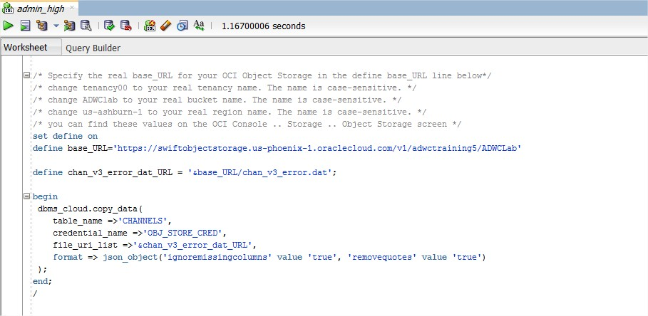

-   Run the following query to see the load that errored out.
    ```
    select * from user_load_operations where status='FAILED';
    ```

    

A load or external table validation that errors out is indicated by status=FAILED in this table. Get the names of the log and bad files for the failing load operation from the column **logfile\_table** and **badfile\_table**. The logfile_table column shows the name of the table you can query to look at the log of a load operation. The column badfile_table shows the name of the table you can query to look at the rows that got errors during loading.

-   Query the log and bad tables to see detailed information about an individual load. In this example, the names are copy$25_log and copy$25_bad respectively.

        

-   To learn more about how to specify file formats, delimiters, reject limits, and more, review the <a href="https://docs.oracle.com/en/cloud/paas/autonomous-data-warehouse-cloud/user/dbmscloud-reference.html" target="_blank"> DBMS_CLOUD Package Format Options </a>

-   Keep your SQL Deveoper open and move to the next lab - Querying External Data.

<table>
<tr><td class="td-logo">[](#)</td>
<td class="td-banner">
## Great Work - All Done!
**You are ready to move on to the next lab. You may now close this tab.**
</td>
</tr>
<table>
