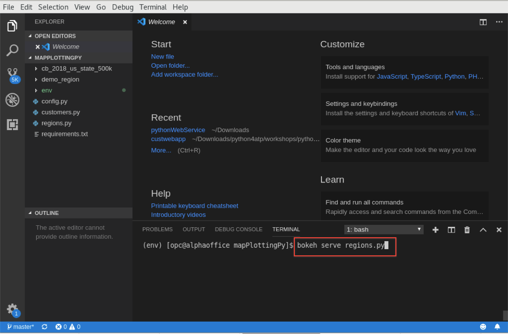
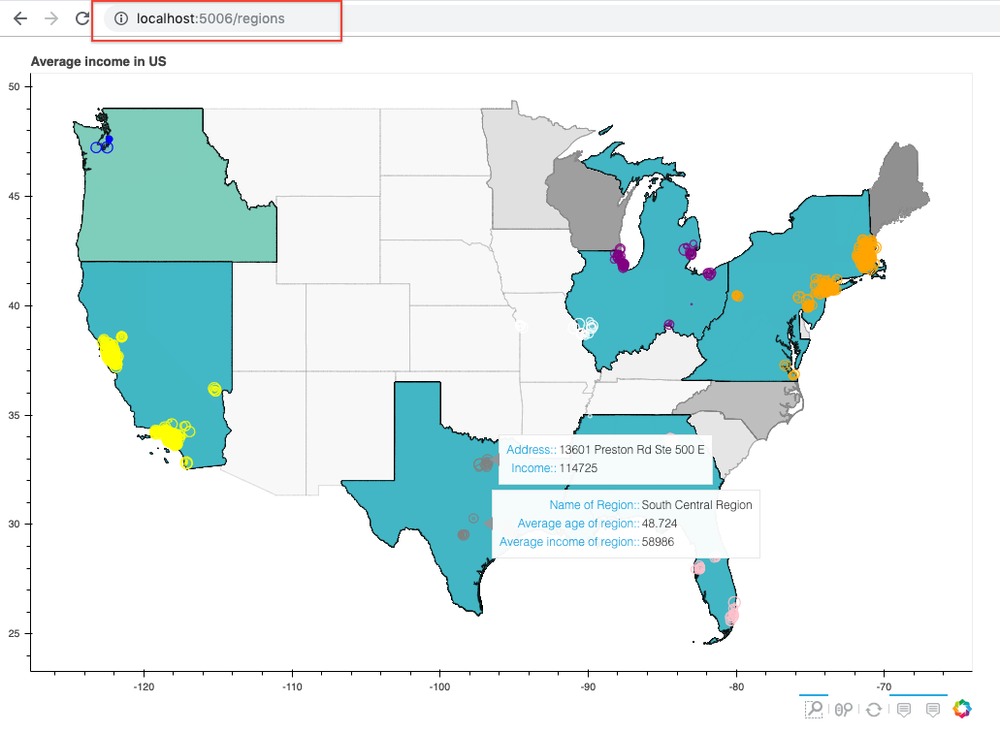
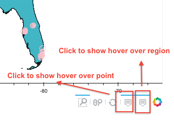

# Lab 400: Show Customers by Region on Map

  

## Introduction

Marketing is also interested in a map like interface to assess and establish sales and sales forecasts for new proposed sales regions, which are defined in shape files that are maintained in marketing systems.  There was concern that merging and processing external shape files with online Oracle Autonomous Transaction Processing Database customer data on the fly would be complicated and time consuming, but again Oracle's extensive Spatial support that has been developed over decades and used by Oracle's largest enterprise customers has recently been added to Autonomous Databases, is a good fit for this use case.  Derek will take those shape files and display them as regions on the map, and identify and display customers in those regions, and derive sales from within those.  He will use the GeoPandas Python extension, and Oracle's native Spatial functions in the Autonomous Transaction Processing Database.

## Lab 400 Objectives

- Show the regions in map from the shapefile.

## Steps

### **STEP 1:** Plot customer based on region

- If you closed the terminal, open it again and make sure to be in virtual env. Run the command

    `$ bokeh serve regions.py`

    Now we have our web service running. Leave the terminal as it is.

    

- To confirm everything works fine, open firefox and go to URL [http://localhost:5006/regions](http://localhost:5006/regions).

    

- The regions you see in the map are plotted from the data in the shapefile. If you want to check the files it is in the application folder named demo_region. We are using **geopandas** to convert the shapefile in dataframe and perform operations on it.

- To show/hide hover points click on the hover tool in the toolbar as shown below.
 
    

