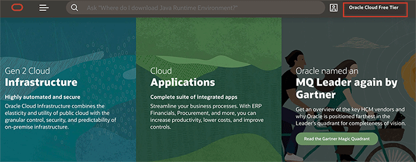
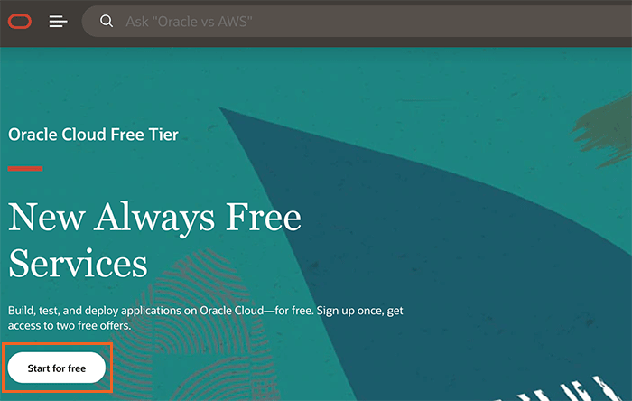
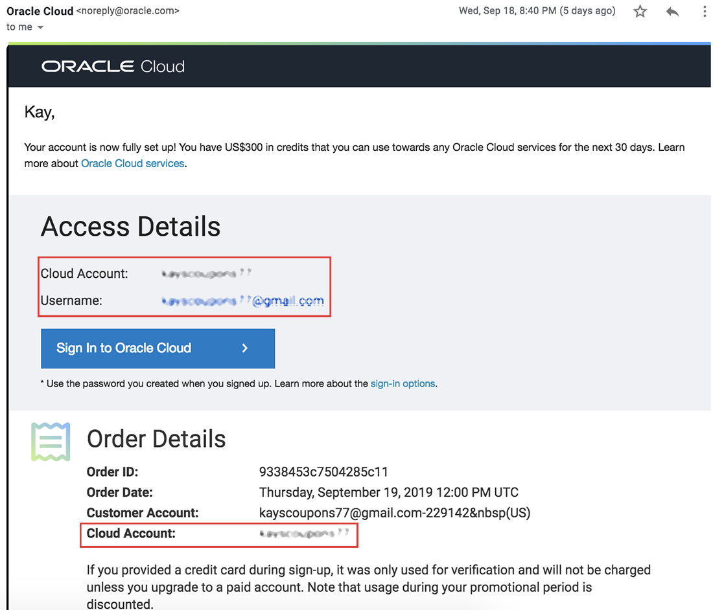
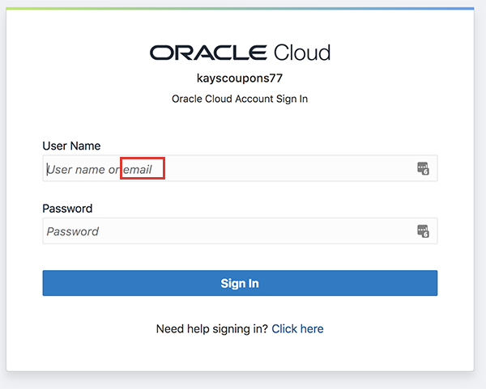
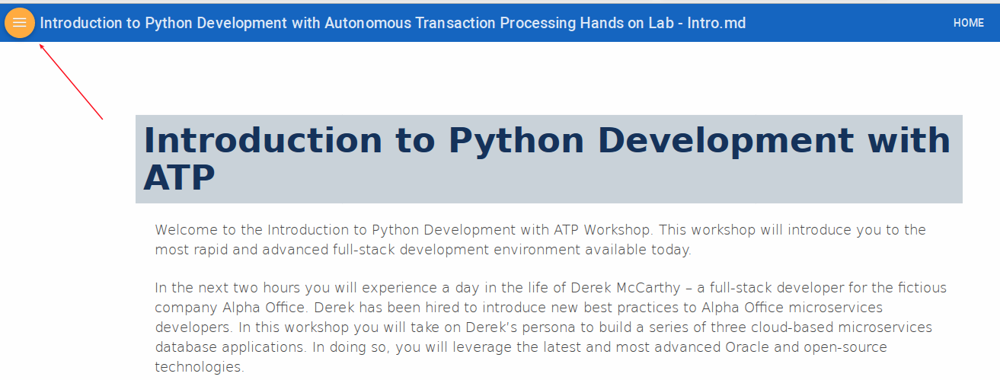

# Introduction to Python Development with Autonomous Transaction Processing

Welcome to the Introduction to Python Development with Autonomous Transaction Processing Workshop. This workshop will introduce you to the most rapid and advanced full-stack development environment available today.

In the next two hours you will experience a day in the life of Derek McCarthy – a full-stack developer for the fictious company Alpha Office. Derek has been hired to introduce new best practices to Alpha Office microservices developers. In this workshop you will take on Derek’s persona to build a series of three cloud-based microservices database applications. In doing so, you will leverage the latest and most advanced Oracle and open-source technologies.

As Derek, you will spin up a new Oracle Cloud Developer Image from the Oracle Marketplace to quickly and easily deploy a complete development environment that is accessible from any location. You will also deploy the Oracle Autonomous Transaction Processing (Autonomous Transaction Processing) Cloud Service providing the full power of the Oracle database while requiring minimal administrative effort and minimal database knowledge and training.  

Additionally as Derek, you will work within the Oracle Cloud Developer Image to create Python microservices. You will utilize the best open source technologies to complement the Python language, including the Visual Studio Code IDE, the Flask micro web framework, the Bokeh interactive visualization library and the ReactJS Facebook JavaScript library.  

Finally as Derek, you will create a pair of spatial applications. To do this you will utilize the GeoPandas extensions to Python together with Oracle Spatial functionality within the Autonomous Transaction Processing database.

**_To log issues_**, click here to go to the [github oracle](https://github.com/oracle/learning-library/issues/new) repository issue submission form.

# Acquire an Oracle Cloud Free Tier Account or Workshop Account

If you already have an account or an active trial/free tier account, you may skip this section.  If not, you will be creating all required infrastructure components within your Oracle Cloud Free Tier account.

- Bookmark this page for future reference.

## Sign Up for a Free Tier Account

- Open up a browser and navigate to www.oracle.com. Click the **Oracle Cloud Free Tier** button in the upper right hand corner.

    

- Click on the **Start for Free** button

    

- Follow the instructions to create your account.  Be sure to enter an email you can access.  

  

- Once you complete the signup, you will receive the **Your Cloud Account is fully provisioned** Email, make note of your **Username and Cloud Account Name**.   *Note: `Usernames are usually your email address.`*  You can login by clicking the Sign In button or access it from any browser.

    

## Login to Oracle Cloud Account

- From any browser go to oracle.com to access the Oracle Cloud.

    [https://www.oracle.com/](https://www.oracle.com/)

    

- Click the icon in the upper right corner.  Click on **Sign in to Cloud** at the bottom of the drop down.  *NOTE:  Do NOT click the Sign-In button, this will take you to Single Sign-On, not the Oracle Cloud*

        

- Enter your **Cloud Account Name** in the input field and click the **My Services** button. If you have a Free Tier account provisioned, this can be found in your welcome email. Otherwise, this will be supplied by your workshop instructor.

      

- Enter your **Username** and **Password** in the input fields and click **Sign In**.

     

  **NOTE**: You will likely be prompted to change the temporary password listed in the welcome email. In that case, enter the new password in the password field.

## **Navigate to Lab 050**

  - _You can see a list of Lab Guides_ by clicking on the **Menu Icon** in the upper left corner of the browser window.

  

  

You're now ready to continue with [**Lab 050**](LabGuide050.md).
